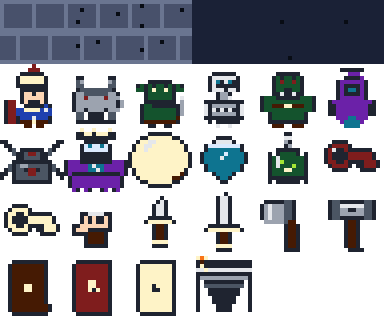

---

# This game is a Work In Progress

---

A turn-based, procedurally generated dungeon roguelite. Explore fog-covered floors, fight distinct enemies, collect weapons and boons, and descend ten floors to escape. The game is optimized for use on larger devices such as a computer or tablet. Smaller phones work, but the board and HUD are cramped.

## [**Link to Game**](https://chalwk.github.io/pages/browser-apps/games/dead-end-dungeon-roguelite)

---

## Sprites



Every actor and prop on the board is one of these: the player, all six enemies, the boss, doors, stairs, keys, potions, weapons, gold, and the terrain itself. Walls and floors are sprites too, just ones the dungeon picks from automatically.

---

## Features

* Procedural floor generation: rooms are scattered, connected by corridors, then assigned roles
* Every sprite on the board is inline SVG pixel art: player, enemies, boss, doors, stairs, keys, potions, weapons, gold, and the terrain underfoot
* Textured terrain: walls are running-bond brick, floors are speckled stone. Each tile picks a variant from a small set so large rooms and long corridors never look flat or obviously repeating
* Fog of war with line of sight. Tiles stay remembered once seen, but dim when out of view
* Turn-based movement with bump-to-attack combat
* Six enemy types, each with its own AI: coward, skirmisher, sentinel, brute, stalker, ambusher
* Five tier weapon ladder, each weapon with a unique on-hit effect. Every pickup is your choice: equip it or sell it for gold
* Twelve run boons that change how the run plays
* Locked progression: the red key unlocks the exit door, gold keys open vaults
* Secret rooms hidden behind wall tiles that shimmer when you get close
* Six floor themes that modify vision, damage, gold, and enemy aggression
* Ten floors, ending in a three phase boss fight
* Three dungeon sizes and three difficulty settings
* All sound generated at runtime with the Web Audio API, no asset files
* Keyboard and touch controls

---

## How to Play

Goal: descend ten floors and defeat the Crypt Warden on the last one.

**Controls:**

* WASD or arrow keys: move. Moving into an enemy attacks it
* Space: wait one turn
* P: drink a potion
* M: mute or unmute
* Touch devices show an on-screen D-pad

**Rules:**

* Every move is a turn. Enemies act after you
* Find the red key, unlock the red door guarding the exit room, then step on the stairs to descend
* Gold keys open vaults, which hold a weapon, gold, and an elite guard
* Shrines, armories, libraries, and cleared gauntlets offer a choice of reward
* Boons last the whole run. Every weapon you find is yours to equip or sell for gold
* Potions heal, and each floor restores a little health
* Changing dungeon size or difficulty starts a new dungeon

---

## Design Notes

A running log of how the game is built, what is done, and what is still rough.

### File Structure

The game recently moved from one monolithic `script.js` into focused modules. These are plain (non-module) scripts sharing one global scope rather than ES modules, so `index.html` loads them in a fixed order that mirrors the original file's top-to-bottom section order:

```
dead-end-dungeon-roguelite/
├── index.html
├── sprites.js
├── style.css
├── spritesheet.png
├── build-spritesheet.bat
└── js/
    ├── dom.js
    ├── constants.js
    ├── utils.js
    ├── state.js
    ├── audio.js
    ├── helpers.js
    ├── dungeon.js
    ├── vision.js
    ├── render.js
    ├── boons.js
    ├── combat.js
    ├── items.js
    ├── turns.js
    ├── game.js
    └── input.js
```

* **`index.html`** - The Jekyll page markup: the HUD, the settings bar, the dungeon board container, the choice modal, the game-over overlay, and the touch D-pad. Loads `sprites.js` first, then every file in `js/` in dependency order.
* **`style.css`** - All visual styling: panel and HUD layout, tile and cell sizing, HP/status chips, the choice and game-over overlays, animations, and the responsive/touch breakpoints.
* **`sprites.js`** - The character-grid sprite data (one row of letters per line, mapped to a shared palette) plus the `sprite()` compiler that merges each grid into a compact inline SVG.
* **`js/dom.js`** - Grabs every DOM element handle the game touches (board, HUD fields, buttons, modals) up front, so the rest of the code just references ready-made constants.
* **`js/constants.js`** - The data tables that drive the game: `TILE` ids, direction vectors, dungeon size and difficulty presets, `ROOM_HUES`, the weapon ladder, enemy roster, floor themes, boons, and room types.
* **`js/utils.js`** - The `sprite()` lookup helper and the deterministic tile-hashing functions that pick a stable wall/floor texture variant per coordinate.
* **`js/state.js`** - The mutable, module-level game state: the grid, discovered/visible fog arrays, rooms, enemies, items, the player object, current floor/theme, and turn/UI flags like `turnBusy` and `choicePending`.
* **`js/audio.js`** - The oscillator-based Web Audio engine and every named sound wrapper (move, hit, key, door, floor, death, victory), plus the mute toggle.
* **`js/helpers.js`** - Small, stateless utilities used everywhere: random ints, array shuffle/pick, bounds checks, tile/entity lookups (`tileAt`, `enemyAt`, `itemAt`), and room-geometry helpers.
* **`js/dungeon.js`** - Procedural generation: scattering rooms, carving corridors with a multi-source BFS, assigning room roles by graph distance, placing vaults and secret rooms, and spawning enemies, items, and the boss.
* **`js/vision.js`** - Line-of-sight (a Bresenham line test) and the fog-of-war pass that recomputes which tiles are currently visible versus merely discovered.
* **`js/render.js`** - Fits the panel to the viewport, then draws the board, HUD, and the layered per-cell SVG stack (terrain, map features, entities, player).
* **`js/boons.js`** - Granting and checking boons, and the choice-modal system shared by weapon pickups, boon offers, and room rewards.
* **`js/combat.js`** - Player and enemy attack resolution: weapon bonus stacking, damage rolls, enemy AI move selection per archetype, and status effects.
* **`js/items.js`** - Pickup handling for gold, potions, keys, and weapons found on the floor.
* **`js/turns.js`** - The per-turn pipeline: resolving a move/attack, waiting, drinking a potion, then running the enemy turn and re-rendering.
* **`js/game.js`** - Game lifecycle: building a new player, starting a run, advancing floors, and handling death or victory.
* **`js/input.js`** - Keyboard and touch/D-pad input wiring, button event listeners, and the initial boot call that starts the first game.

---

### Data and Architecture

I've kept the content data-driven. Tiles, weapons, enemies, themes, boons, room types, terrain variants, and sprites are plain arrays and objects. Adding a weapon or an enemy means adding one entry, not editing the engine. War Hammer's knockback is still a WIP: the table entry declares `knockback: true` and the in-game description advertises it, but `playerAttack()` does not read the field yet, so the hit lands without the push.

Scaling happens through multipliers. Difficulty and floor depth adjust HP, damage, and spawn counts with multipliers. There are no separate code paths per difficulty.

I try to use hooks instead of special cases. Themes expose optional hooks such as `onEnemySpawn` and `onPlayerDamaged`, so a theme can change behavior without the engine knowing about it.

Boons act mostly as flags. Boon effects are queried by id at the moment they matter, so most boons are one table entry plus a check where it applies. The exception is the two boons that move max HP (`iron_will`, `glass_fang`). Those also need a line in `addBoon()` because the stat has to be applied when the boon is granted, not when it's read.

### Sprite System

Sprites are character grids. Every sprite is a small array of equal-length strings, one row per line, where each character maps to a color in a shared palette. `.` is transparent. Drawing the player means typing out a sixteen line tall grid of letters; adding a new enemy means the same. No image editor, no asset pipeline, no coordinates to fiddle with. If you can see the shape in the text, you can see the sprite.

One shared compiler handles all sprites. A single `sprite()` helper walks each grid row, merges horizontal runs of the same color into one `<rect>`, and emits a compact inline SVG with `shape-rendering: crispEdges`. That means the sprites stay pixel-perfect at any cell size the layout picks. The browser scales the viewBox, not a bitmap, so there is no blurry upscaling and no need to ship multiple resolutions.

Mirror, don't duplicate. The player sprite is drawn facing right. When the player moves left, the renderer adds a single CSS class that flips the SVG with `scaleX(-1)`. One sprite covers both directions.

Sprites show up where they matter. The equipped-weapon chip and the choice-card modals render from the same sprite set as the board. When you equip the War Hammer, the chip next to your HP bar shows the same hammer the board would. The boon, room, key, and potion chips use emoji and text glyphs instead, which keeps the HUD legible at small sizes.

No assets. Sound is oscillators, visuals are inline SVG sprites and text glyphs.

### Dungeon Generation

Generation happens in stages. Rooms are placed first, corridors carved second, and room roles assigned last using a graph distance pass. Non-start rooms are ranked once: dead ends first, then by graph distance from the entrance, descending. The exit takes the top slot. The vault is a single optional pick. The floor has a 28% chance to spawn one at all, and it prefers a remaining dead end, falling back to the next-best ranked room if the extra corridor edges left the graph without one. Ranking before assigning rather than filtering after the fact is what keeps the exit slot from stealing every leaf.

Graphs over coordinates. Room connections are stored as a graph, so distance and dead ends come from a breadth first search instead of geometric guessing.

Doors mark real crossings only. A corridor becomes a door exactly where it crosses into a room's interior, never anywhere else along that room's wall, so every door on the map means something.

Every route in is locked. The exit room can end up with more than one corridor leading to it, so every extra entrance gets walled off and the single surviving one becomes the red door. Progress always waits on the key, never on a graph coincidence.

### Rendering and Terrain

Two layers of fog. Discovered tracks memory, visible tracks current sight. Rendering reads both, so remembered tiles dim rather than vanish.

Textured terrain without a texture atlas. Walls and floors are sprites like every other tile, drawn from the same pixel-art pipeline. Walls use a running-bond brick layout: the top brick row's vertical joints sit at the cell edge, the bottom row's are offset, so side by side wall tiles read as one continuous brick surface rather than a grid of squares. Each wall has a highlight at the top of the brick, mid stone through the body, and a darker bottom for a shallow 3D read.

Per-room floor tinting is wired in but not shipped yet. `ROOM_HUES` has an entry for every room type and the engine applies each room's `floorHue` to its cells, but every value in the table is currently `222`, so the whole floor still renders the same blue. The plumbing is there; the palette is what is left to fill in.

Deterministic variants, not random. Each tile hashes its own coordinates to pick from the wall and floor variant sets. The hash is stable, so a tile keeps the same look on every render. `Math.random()` here would make the entire dungeon flicker on every step. The same trick gives the whole floor subtle scattershot variation while still being cheap enough to redraw from state on every action.

Layered rendering. Every cell is drawn as a stack of SVG layers: terrain first, then map features (doors, stairs), then entities (enemies, items), then the player. Features and entities no longer replace the floor beneath them, so an enemy standing on stone still sits on stone. That also means the fog's "dim" state can hide entities while leaving terrain and map features readable. Remembered exits stay visible on the map, entities on remembered tiles don't.

Full redraw on every render. The board is rebuilt from state whenever the game state changes. At this grid size that is cheap, and it removes a whole class of stale UI bugs.

### Game Flow and Player Choice

One action, one turn. Every player action follows the same sequence: resolve, then enemies act, then render. Choice modals pause that sequence and resume it when closed. Enemy movement is currently cardinal only. `chooseEnemyMove()` and both fallback move loops use `DIRS4`. `DIRS8` is declared near the top of `script.js` for a planned eight-way movement pass, but nothing references it yet, so diagonal enemy stepping is on the list rather than in the game.

Player choice over auto-resolution. Weapon pickups open a choice modal instead of the game deciding for you, using the same modal system as boons and armories.

---

## TO DO

### Combat

* Diagonal Attack Parity - Fix the asymmetry. `enemyCanAttack()` uses `distance()` (Chebyshev), so enemies cam attack diagonally. The player can only attack on cardinal WASD/arrow moves through `tryMove()`, so the exchange is one-sided. I'll either extend `tryMove()` to accept diagonal input (QEZC / diagonal D-pad buttons) or switch `distance()` to Manhattan and lock enemies to 4-way too. Parity fix is probably the cheaper one.
* War Hammer Knockback - Finish Implementing (read `knockback` in `playerAttack`, push the enemy one tile away from the player on hit). Resolve the target tile against `isWalkableTile`, enemy occupancy, and my own position before moving. Skip the push if the tile is blocked.
* Weapon Tier Roll - Clamp the floor 1 case. `randomWeaponAtTier(1 + Math.floor((floor - 1) / 3), 3 + Math.floor((floor - 2) / 5))` computes a `maxTier` of 2 on floor 1 because of the negative division. Wrap the second arg in `Math.max`.

### Dungeon

* Floor Colouring - Decide between `ROOM_HUES` and floor sprite variants. Every hue is parked at `222` on purpose until that call is made. I may drop `ROOM_HUES`, the `--floor-hue` CSS var, and the `floorHue` write in `renderBoard()`, then add the per-room floor sprites to `sprites.js` and a variant lookup keyed by room type.
* `buildDungeon()` retry - I may convert the recursion to a loop. The current save/restore of `floorBuildRetryCount` around the recursive call works but reads poorly.

### Enemy AI

* Remove `DIRS8`. It was added for an eight-way movement pass that I decided against. Enemies already step diagonally through `chooseEnemyMove()`, which returns `{ x: sign(dx), y: sign(dy) }` and lands first in the `tryMoves` list, so the const never had a job.

### Architecture

* Boon Grant Hook - Add `onGrant(player)` to the boon entry and drop the `iron_will` / `glass_fang` special cases in `addBoon()`. Keeps grant-time effects data-driven like the rest of the boon table.
* `corridorPathAllowed()` - Drop the unused `roomA` and `roomB` params. The room checks go through `rooms.some(...)` directly.
* `findCorridorPath()` - Drop the `visited[ny]?.[nx]` optional chain. `inBounds(nx, ny)` already runs upstream.

### Cleanup

* Console Spam - Gate the `console.log` calls in `buildDungeon()` (vault placement, key placement, vault spawn counts) behind a `DEBUG` flag.
* Same flag for the `console.warn` / `console.error` in the validation retry path.

### Layout

* Small Phone Viewports - Rework the `@media (max-width: 480px)` and coarse-pointer blocks in `style.css`. Under ~480px the board shrinks, HUD chips wrap to two rows, and the D-pad fights the log for vertical space. This should just be a CSS pass, not a script change.

---