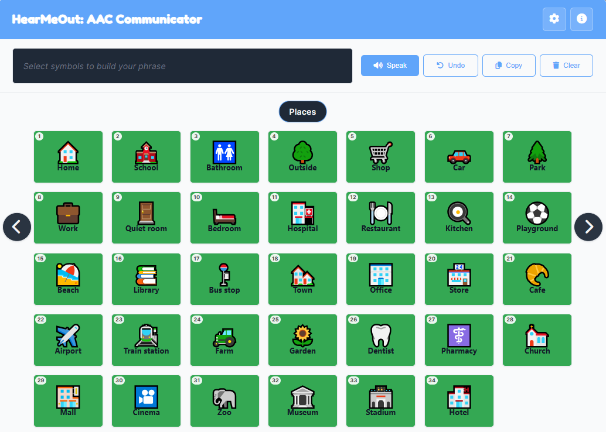

---

# This app is actively maintained

---

A symbol-based AAC (Augmentative and Alternative Communication) board that runs entirely in a browser. Tap symbols to build a phrase, then have it spoken aloud. Categories keep the board from becoming a wall of icons, edit mode lets you build your own vocabulary on the fly, and the whole thing works offline once loaded. No account, no install, no subscription.

## [**Link to App**](https://chalwk.github.io/pages/browser-apps/tools/hear-me-out)

---

## Why this exists

This one is personal.

I have non-verbal episodes - often enough that I started looking for a tool I could keep open on my device(s) and actually use. What I found in New Zealand was a brick wall: AAC software here is either expensive, gated behind an assessment, tied to a specific piece of hardware, or all three. There is no free, well-designed, browser-based option that does the obvious thing - let you tap symbols and speak.

So I made one. Not as a portfolio piece, not because the world needed another web app, but because I needed this one and couldn't find it. If it's useful to someone else in the same position, that's the entire point.

Everything is free, everything runs client-side, and nothing leaves your device.

---

## Screenshots



The board view: category indicator up top, symbol grid in the middle, phrase bar along the top with Speak, Undo, Copy, and Clear. A long-press on any symbol previews its speech without adding it to the phrase.

---

## Features

* Tap-to-build phrase bar with drag-to-reorder chips, tap-to-remove, and keyboard reordering
* Speech synthesis for the whole phrase and for individual symbols via long-press preview
* Optional "speak as I build" mode - the tapped symbol speaks immediately
* Thirteen built-in categories, fully renameable and deletable, with symbol categories merging in automatically
* In-app edit mode: add, edit, and delete symbols without touching a text file
* Any image source for a symbol: emoji, an https:// URL, a data: URL, or an uploaded file
* Import and export as JSON, so a board can be shared, backed up, or moved between devices
* Real theming: light, dark, high-contrast, and auto (follows the OS)
* Grid sizing: auto-responsive, or fixed 3×4 / 4×6 / 6×8 for predictable layouts
* Keyboard navigation for everything: arrow keys change category, number keys speak cards, Ctrl+Z undoes
* Touch-first interactions: swipe left/right to change category, long-press to preview, drag to reorder
* Speech volume and voice selection, persisted per device
* Undo history for phrase edits (up to 50 steps)
* Copy phrase to clipboard as plain text
* Fully responsive, down to small phones
* Works offline after first load
* No accounts, no tracking, no server

---

## How to Use

Goal: build a phrase, then have it spoken.

**Controls:**

* Tap a symbol: adds it to the phrase bar
* Long-press a symbol: speaks it without adding it
* Tap a phrase chip: removes it
* Drag a phrase chip: reorders it
* Swipe left/right on the board: previous/next category
* Left/right arrows: previous/next category (keyboard)
* Speak button: reads the whole phrase aloud
* Undo / Copy / Clear: as labelled

**Keyboard shortcuts:**

* `E` - toggle edit mode
* `Ctrl+Z` (or `Cmd+Z`) - undo last phrase change
* `Enter` / `Space` - add focused symbol
* `←` / `→` - previous / next category
* `Delete` / `Backspace` - remove the focused phrase chip
* `1`–`9`, `0` - speak card 1–10
* `Ctrl+1`–`Ctrl+9`, `Ctrl+0` - speak cards 11–20
* `Alt+1`–`Alt+9`, `Alt+0` - speak cards 21–30
* `Ctrl+Alt+1`–`Ctrl+Alt+9`, `Ctrl+Alt+0` - speak cards 31–40
* `Escape` - close the current modal or dropdown

**Rules:**

* Symbols live inside categories. Tap the category name at the top to jump to any category.
* Edit mode changes what a tap does: instead of adding to the phrase, it opens the symbol editor.
* Everything you change is saved to localStorage on this device. Export to move it elsewhere.
* The gear menu holds Add Symbol, Edit Mode, Save, Export, Import, Manage Categories, and Additional Settings.

---

## Design Notes

A running log of how the app is built, what has been reworked, and what is still rough.

<details>
    <summary>Click to expand</summary>

### File Structure

The app is a Jekyll page, so the markup is a Markdown file with YAML front matter, but the app itself is plain HTML/CSS/JS with no build step and no dependencies beyond a Google Fonts import. The application code lives in `js/` as ES modules, loaded through a one-line entry stub.

```
hear-me-out/
├── index.html
├── style.css
├── script.js
├── symbols.txt
├── manifest.webmanifest
├── sw.js
├── sw-core.js
├── icons/
│   ├── icon-192x192.png
│   └── icon-512x512.png
└── js/
    ├── board.js
    ├── categories.js
    ├── config.js
    ├── dom.js
    ├── helpers.js
    ├── importExport.js
    ├── main.js
    ├── modals.js
    ├── phrase.js
    ├── settings.js
    ├── speech.js
    ├── state.js
    ├── storage.js
    ├── swipe.js
    ├── symbols.js
    └── toast.js
```

* **`index.html`** - The Jekyll page. Contains the header, the settings dropdown, the phrase bar, the board container with category navigation, four modals (edit symbol, manage categories, additional settings, info), and the toast. Loads `style.css` and `script.js` (as `type="module"`).
* **`style.css`** - Everything visual: layout, theming tokens, symbols, phrase chips, modals, the board grid, responsive breakpoints, and a dedicated `prefers-reduced-motion` and `@media print` block.
* **`script.js`** - A one-line entry stub: `import './js/main.js';`. Kept at the app root so it stays in the service worker's pre-cache list and in the manifest without special-casing this app.
* **`symbols.txt`** - An optional default board loaded on first run if the user has no saved data. One line per symbol, semicolon-separated: `text;image;color;category`. The app falls back to an empty board with the default category list if the file is missing or malformed.
* **`manifest.webmanifest`, `sw.js`, `sw-core.js`** - PWA plumbing. `sw-core.js` is the shared service worker body used across every browser app on this site; `sw.js` is the per-app shim that defines `CACHE_NAME` and pulls in the core. Only the entry stub is pre-cached, everything else is picked up network-first on first load.
* **`icons/`** - PWA icons referenced by the manifest.

The `js/` directory holds the application, split by concern:

* **`main.js`** - The entry point. Wires up every event listener, runs the keyboard shortcut handler, and kicks off `init()` on DOM ready. This is the only module that imports from almost all the others.
* **`config.js`** - Local storage keys, the max image size, the phrase-history cap, and the default category list. The only module that knows the raw constants.
* **`state.js`** - A single exported object holding all mutable app state: symbols, phrase, history, settings, current category, swipe and drag bookkeeping, toast timers, and the modal stack. Centralising state means no module needs to hold its own copy.
* **`dom.js`** - Cached `getElementById` lookups for every element the app touches, exported by name. Imported once, referenced everywhere. No module ever calls `document.getElementById` directly.
* **`toast.js`** - `showToast()`, with the tracked visible/hide timers that prevent the overlapping-timer bug.
* **`modals.js`** - Focus stack, focus trap, backdrop-click handling, and `openModal` / `closeModal` / `closeTopModal`. Modals register their own closers so `closeTopModal` can dispatch to the right handler.
* **`storage.js`** - Everything that touches `localStorage` or `fetch`: load/save symbols, load/save settings, theme application, and the category list getter/setter. Also the only module that knows about `symbols.txt`.
* **`helpers.js`** - `isUrl()` and `isImageSource()`. Small, pure, imported wherever needed.
* **`categories.js`** - The category list, the ordered copy used for navigation, the indicator, the jump-to dropdown, and add/rename/delete. Category changes call back into the board renderer via a callback registered by `main.js`, avoiding a circular import.
* **`symbols.js`** - The edit-symbol modal: open, close, save changes, delete, and the file-to-data-URL helper. Registers its board-render callback the same way.
* **`board.js`** - `renderBoard()`, `applyGridSetting()`, and `animateCategoryChange()`. Builds every symbol node, wires tap, long-press, keyboard, and hover state.
* **`phrase.js`** - The phrase bar: add, undo, clear, copy, drag-to-reorder, keyboard reorder, and `updatePhraseDisplay()`.
* **`speech.js`** - `speakPhrase()` and `previewSpeak()`. Wraps `speechSynthesis` with voice lookup and the fallback path.
* **`settings.js`** - The settings and manage-categories modals, the settings dropdown menu, voice population, and the modal handlers. This is where UI-only concerns live; the actual persistence happens through `storage.js`.
* **`importExport.js`** - JSON export and import. Merges imported categories and symbols rather than replacing, and rewrites conflicting symbol ids on the way in.
* **`swipe.js`** - Touch-only swipe navigation on the board container, wired to `animateCategoryChange`.

No bundler, no transpiler, no framework. The browser loads `script.js`, which loads `js/main.js`, which loads the rest. Open the file, and it runs.

### Data and Architecture

Everything is localStorage-backed. Symbols, categories, settings, voice choice, and the current category index are each stored under their own `cb.*` key. There is no server, no sync, no sync conflict, no migration problem - because there is nothing to migrate against.

The app is deliberately stateful. A single `state` object (in `state.js`) holds the handful of mutable values that drive the entire UI: `symbols`, `currentPhrase`, `phraseHistory`, `settings`, `categoriesOrdered`, `currentCategoryIndex`, `isEditMode`. Every module imports that same object rather than keeping its own copy, so there is no possibility of two modules disagreeing about what the current phrase is. When any field changes, the relevant render function is called and the DOM is rebuilt from state. There is no two-way binding, no virtual DOM, no diffing. At this scale, a full redraw of the board (a few dozen nodes) is cheap, and it removes an entire class of stale-UI bugs that come from hand-patching pieces of the DOM.

Functions are small and single-purpose. `renderBoard()` draws the symbols for the current category. `updatePhraseDisplay()` redraws the phrase bar. `renderCategoriesList()` rebuilds the manage-categories modal. Each one clears its container and rebuilds it. The cost is trivial, and the result is that I never have to ask "is this piece of UI in sync with state?"

The split across modules is by concern, not by layer. `storage.js` owns persistence; `categories.js` owns the category list and navigation; `board.js` owns rendering; `speech.js` owns TTS. Two modules (`categories.js` and `symbols.js`) need to trigger a board redraw after they mutate state, and rather than importing `board.js` directly - which would create a circular import through `main.js` - they expose a `setBoardRefresh()` / `setRenderBoard()` callback that `main.js` wires up at startup. That is the only indirection in the app, and it exists purely to keep the module graph acyclic.

The category system is a flat array of strings. Symbols reference their category by name, not by id. Renaming a category walks the symbols array and rewrites the ones that matched. Deleting one reassigns affected symbols to `Basic Communication`. There is no referential integrity problem because there are no references - just strings that happen to match.

### Symbol System

A symbol is four fields: `{ id, text, image, color, category }`. `text` is what gets spoken. `image` is either an emoji (a single character or two), an http(s) URL, a data: URL, or a base64 data URI from an uploaded file. `color` is the background tint. `category` is the string name of the category it lives in.

That is deliberately loose. The same rendering path handles an emoji symbol, an SVG URL, and a 200KB uploaded JPEG without any branching beyond `isImageSource()`, which just checks whether the string looks like a URL or a data URI. If it does, render an ``; if not, render the string as text.

IDs are numbers, assigned as `max(existing ids) + 1` on creation and never reused. That is enough to keep imports from colliding: when a JSON file is imported, any incoming id that already exists is rewritten to the next available number. No UUIDs, no hash collisions, no duplicated symbols across imports.

Uploaded images are capped at 2 MB. That cap is not arbitrary - localStorage has a hard quota of about 5 MB in most browsers, and a single oversized photo will blow it and silently fail every subsequent write. The cap is enforced at file-select time with a clear error, so the failure mode is visible.

### Categories and Navigation

Categories are the entire navigation model. There is no search, no tag filter, no folder tree. Instead, the board shows one category at a time, and the user switches between them by swiping, by tapping the category indicator (which opens a jump list), or by pressing left/right.

That is deliberate. For AAC use, hunting through a search box is slower and more cognitively expensive than swiping to a known screen. The category names are visible, the current one is always on screen, and the jump list gives direct access when the user knows where they're going.

Category changes animate with a short fade rather than an instant swap. That gives the eye a moment to register that the content changed, which matters more than it sounds when you are using the same board repeatedly and the muscle memory is strong.

The current category index persists across reloads, so closing the tab and reopening it puts you back where you were. That is a small thing that turns out to matter a lot in practice - the whole point of a communication tool is that it should be ready to use the moment you open it, not after a navigation ritual.

Categories also merge automatically. Any category referenced by a symbol that is not in the category list gets added to the list on load. So importing a symbol set from someone else, or hand-editing `symbols.txt` to include a custom category, just works - the list catches up.

### Rendering and Theming

The board is a CSS grid. Symbol size is dictated by the grid template, not by anything in the symbol itself. Auto mode uses `repeat(auto-fill, minmax(120px, 1fr))`; fixed modes use `repeat(3|4|6, minmax(0, 1fr))`. Symbols scale to the cell, images and emojis center inside, text truncates at two lines. The user picks the mode that matches their screen and comfort level.

Theming uses CSS custom properties, not separate stylesheets. A `:root` block defines semantic tokens (`--bg`, `--surface`, `--text`, `--border`, `--primary`, and so on), and theme classes (`theme-light`, `theme-dark`, `theme-high-contrast`) override them. Legacy aliases (`--light`, `--dark`, `--gray`, `--gray-light`) map to the new tokens, so old rules keep working without rewriting them. Auto mode is a single `@media (prefers-color-scheme: dark)` block scoped to `body.theme-auto`, which means the OS preference flows through without any JavaScript listening for changes.

The high-contrast theme is not a joke. It is black on yellow with a hard white border, which is what some users need to distinguish symbols reliably. It exists because "we have a dark theme" is not the same as accessibility.

Motion is respected. A `prefers-reduced-motion` block collapses all transitions to near-zero for users who have asked for that at the OS level. The category fade, the chip hover lift, everything - it all goes quiet.

### Speech and Interaction

Speech is `speechSynthesis`, the browser's built-in TTS. That means no audio files, no server, no latency, and no per-device install - but it also means the voice list is whatever the OS exposes, and voice quality varies enormously between platforms. The app lists every available voice by name and language, and the user picks one. If the chosen voice later disappears (OS update, different device), the app falls back to default and tells the user why.

"Speak as I build" is opt-in. For some users, hearing every tap is reinforcement. For others, it is noise. The default is off, and the toggle is one click away in Settings. That default matters because the two modes are genuinely incompatible - you cannot use the app the same way if every tap produces sound.

Long-press preview is the compromise. Holding a symbol for about half a second speaks it without adding it to the phrase. That gives the user a way to check what a symbol says without committing to it. The long-press cancels on movement, so a scroll or a drag does not accidentally fire it.

Phrase reordering uses pointer events, not HTML5 drag-and-drop. This is deliberate. HTML5 DnD does not work on touch devices - the drag handles are invisible to mobile browsers, and the events never fire. For an app whose primary use case is a tablet or phone, that is a fatal gap. Pointer events work everywhere: the same code handles mouse drag on desktop and finger drag on touch. Movement under 6 px counts as a tap (which removes the chip); over 6 px starts a drag. Keyboard users can reorder with left/right arrow keys on a focused chip.

Undo history is a stack of JSON snapshots, capped at 50 entries. Every mutating phrase action pushes a snapshot first: add, remove, reorder, clear. Undo pops and replaces. It is simple enough that it will never be the source of a bug.

</details>

---

## Change Log (26 Sep 2026)

A significant rework was done. Everything below is in the current version.

<details>
    <summary>Click to expand</summary>

### Bug fixes

* **Themes did nothing.** `applyTheme()` toggled CSS classes that had no matching rules. Added real `theme-light`, `theme-dark`, `theme-high-contrast`, and `theme-auto` definitions with semantic token overrides.
* **Toast race condition.** Rapid `showToast()` calls caused overlapping timers and premature hiding. Now uses tracked visible/hide timers that cancel each other.
* **Redundant and inconsistent storage writes.** Settings were written to three keys but read from two, so theme changes were silently lost on reload in some code paths. Now `saveSettings()` writes all keys and `loadSettings()` reads all of them.
* **Double toast on category rename/delete.** Both operations saved symbols non-silently, producing a "Symbols saved" toast on top of the intended one. Now silent.
* **XSS / layout break in the categories list.** The rename modal used `innerHTML` with interpolated category names, which broke on quotes and angle brackets and allowed injection. Now builds elements with `createElement` and `textContent`.
* **Symbol category dropdown forgot its value.** Rebuilding the dropdown reset it to the first option, and symbols whose category was not in the list could not be saved correctly. Now preserves the selected value and auto-adds missing categories.
* **File uploads had no size guard.** An oversized image would silently blow past the localStorage quota and cause every subsequent save to fail. Now capped at 2 MB with a clear error message.
* **`isUrl` semantics were inconsistent.** A `data:` string was treated as a URL in one place and not another, and `isImageSource` duplicated the logic. Simplified into a clear pair of helpers.
* **Long-press preview canceled the phrase.** Triggering a preview while the phrase was being spoken would interrupt it. Preview is now gated and the long-press timer cancels on pointer movement.
* **Swipe state was sticky.** `pointerleave` fired the reset for mouse pointers too, and an unused lock flag never did anything. Removed the flag; swipe reset is now guarded by pointer id.
* **`addCategory` and `renameCategory` used comma-expression returns.** Cleaned up to proper early returns.
* **Symbol number badge overflowed for two-digit numbers.** Switched from a fixed 1.5em circle to a pill with `min-width` and `border-radius: 999px`.
* **Modal backdrop click could close the modal it just opened.** Now requires `pointerdown` and `click` both on the backdrop.
* **`animateCategoryChange` ran on the same index**, producing a fade with no change. Guarded.
* **Category index was lost on every reload.** Now persisted under `cb.categoryIndex` and restored on init.
* **`refreshOrderedCategories` could leave the index out of bounds** when categories shrank. Now resets to 0.
* **Export did not clean up its anchor element.** Now appended, clicked, and removed.
* **Import did not validate its input.** Malformed JSON, non-array categories, and non-object settings could corrupt state. Now validated; imported categories are merged with existing ones instead of replacing them.
* **Board did not handle a missing `image` field** gracefully. Now falls back to `?`.
* **`speakPhrase` fallback was not wrapped.** A thrown error during the retry could break the sequence. Now try/caught.

### New features

* **Undo button** in the phrase bar, in addition to the existing `Ctrl+Z`.
* **Copy button** - copies the phrase as plain text, using the async clipboard API when available and a hidden textarea fallback otherwise.
* **"Speak as I build" toggle** in Settings. When on, tapping a symbol speaks it immediately after adding it.
* **Touch reordering of phrase chips.** The old HTML5 drag-and-drop did nothing on phones and tablets. Pointer events now handle both mouse and touch with a 6 px movement threshold distinguishing tap from drag.
* **Keyboard reordering in the phrase bar.** Focused chips respond to `Delete`/`Backspace` (remove) and `←`/`→` (swap with neighbour).
* **Global keyboard shortcuts.** Number keys, arrow keys, and `Ctrl+Z` now work anywhere on the page except inside form fields and open modals.
* **Modal focus management.** Opening a modal saves the previously focused element, moves focus inside, and traps Tab within the modal. Closing restores focus.
* **Escape closes the top-most modal**, not just the settings dropdown.
* **Backdrop click closes modals**, guarded against the click that opened them.
* **Persistent category index** across page reloads.

### Removed

* Unused `horizontalSwipeLocked` state.
* Duplicate `loadTheme` / `saveTheme` functions, folded into the main settings loader/saver.
* HTML5 drag-and-drop handlers on phrase chips, replaced by pointer-event equivalents.
* The `boardWrap`-scoped keydown listener, replaced by a single `document` listener.
* The dead `.phrase-item.drag-placeholder` rule in CSS.

### CSS

* Added full theme token system with `light`, `dark`, `high-contrast`, and `auto` variants.
* Toast no longer overlaps the floating action button (`bottom: 1rem` → `bottom: 6rem`); z-index raised so it sits above modals.
* Swipe hints are hidden on `hover: hover` and `pointer: fine` devices - they only apply to touch.
* Category indicator, dropdown, and settings menu now use theme tokens instead of hard-coded white.
* `--container-max` was referenced but never defined; declared.
* `.phrase-item` no longer selects text on drag or triggers native image drag.
* Unified focus rings across symbols and phrase chips; both now use `outline: 2px solid var(--primary)`.
* Symbol number badge reworked from a circle to a pill so multi-digit numbers fit.

### Accessibility

* Every interactive element has an accessible label.
* Modals use `aria-hidden`, `aria-modal`, `role="dialog"`, and `aria-labelledby`.
* The phrase display and category indicator are `aria-live` regions.
* The board is a `role="list"` with `role="listitem"` symbols; each symbol announces its text and position.
* Focus is managed across modal open/close and preserved across state changes.
* `prefers-reduced-motion` collapses all transitions.
* A `@media print` block hides chrome for printing the board.

</details>

---

## What is still rough

* The default symbol set is small. It is a starting point, not a full vocabulary.
* `symbols.txt` is a pipe-delimited file with no schema validation beyond a line-length check.
* There is no symbol search. At large board sizes this would help.
* The voice list depends entirely on the OS. On some Linux setups, no voices ship by default.
* Long-press preview requires a still finger. Users with tremor may find it unreliable.
* The high-contrast theme is fine for symbols but the header still uses the primary color, which is less contrasty than it could be.

---